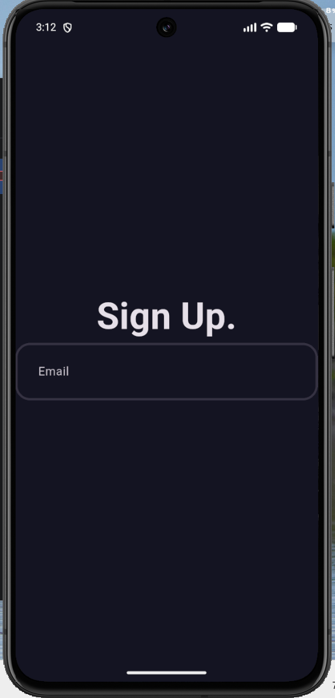
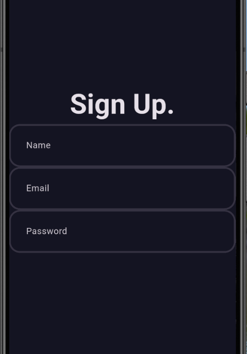
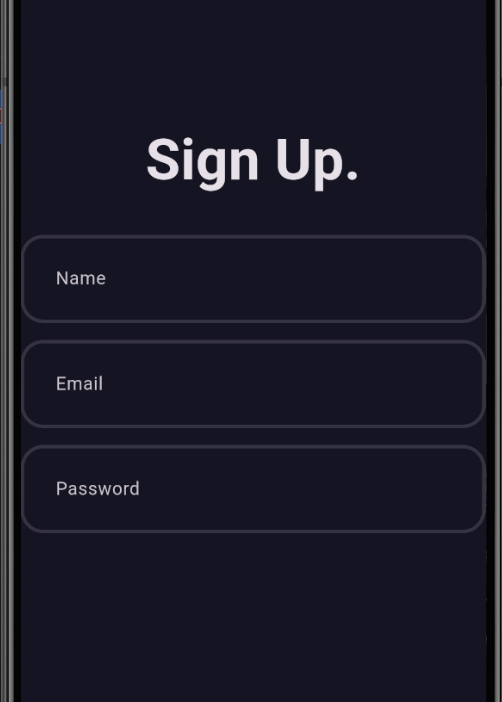
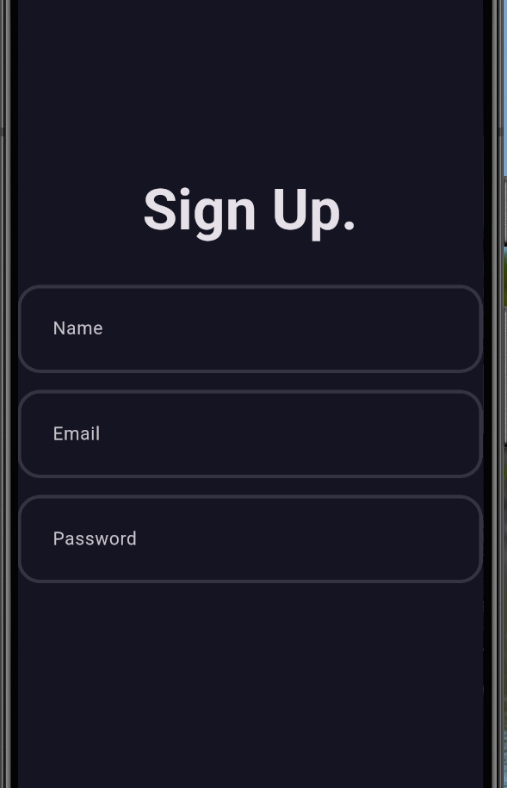
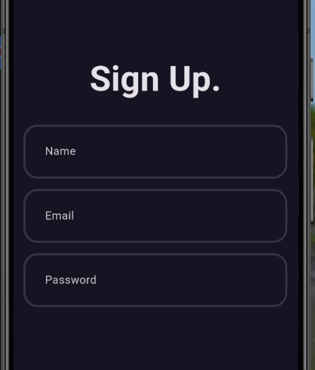

# flutter_application_1

A new Flutter project.

## Getting Started

This project is a starting point for a Flutter application.

A few resources to get you started if this is your first Flutter project:

- [Learn Flutter](https://docs.flutter.dev/get-started/learn-flutter)
- [Write your first Flutter app](https://docs.flutter.dev/get-started/codelab)
- [Flutter learning resources](https://docs.flutter.dev/reference/learning-resources)

For help getting started with Flutter development, view the
[online documentation](https://docs.flutter.dev/), which offers tutorials,
samples, guidance on mobile development, and a full API reference.
screenShots of project = {
    ,
    [this bug in auth filed]<video controls src="20260724-1159-51.2594283.mp4" title="Title"></video>
    [the bug in auth filed is solved]<video controls src="20260724-1212-33.9326661.mp4" title="Title"></video>,
    [color change when click on auth filed]<video controls src="20260724-1315-45.7197348.mp4" title="Title"></video>,
    [padding between up & down elements]
    [padding between up & down elements],
    [padding between right & left elements]
    [padding between right & left elements],

}